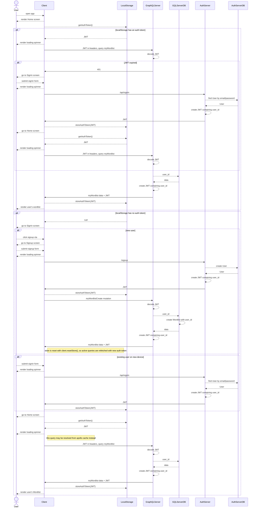

# MyWordlist

An app, for learners of English as a second language, to store and organise their english vocabulary through categorisation. They will also be able to save notes on each wordlist entry. Features may also include:

- For a given category, the app will suggest additional words based on other users' wordlist data
- Generate sentences appropriate to their English level
- Share their Wordlist with other users
- Generate pdfs of their Wordlist with desired words filtered out

## Sequence diagram

### Key

- `Client`: The MyWordlist mobile app or other frontend client
- `GraphQLServer`: https://github.com/Yorkshireman/my_wordlist_graphql
- `GQLServerDB`: `my_wordlist_graphql`'s provisioned postgres database
- `AuthServer`: https://github.com/Yorkshireman/authentication-server
- `AuthServerDB`: `authentication-server`'s provisioned postgres database



## To run whole stack locally

- Run `authentication-server` on port `3001` (`r s -p 3001`)
- Run `my_wordlist_graphql` on port `3000` (`r s -p 3000`)

## For Web

`.env.development`:

```
MY_WORDLIST_GRAPHQL_URL=http://localhost:3000/graphql
RESET_PASSWORD_URL=http://localhost:3001/api/reset-password
SIGN_IN_URL=http://localhost:3001/api/signin
SIGN_UP_URL=http://localhost:3001/api/signup
```

- `RCT_METRO_PORT=<port> npm run web`
- Navigate to `http://localhost:<port>`

NB setting this env var isn't strictly necessary, but the default port will be `8081` which is a common port number and so may clash.

### For iOS Simulator

`.env.development`:

```
MY_WORDLIST_GRAPHQL_URL=http://localhost:3000/graphql
RESET_PASSWORD_URL=http://localhost:3001/api/reset-password
SIGN_IN_URL=http://localhost:3001/api/signin
SIGN_UP_URL=http://localhost:3001/api/signup
```

- Run `authentication-server` with `r s -p 3001`
- Run `my_wordlist_graphql` with `r s`
- `npm run ios`

### For Android Simulator

Hardcode the following values into the code instead of relying on the values being pulled from `.env.development`:
`MY_WORDLIST_GRAPHQL_URL`: `'http://10.0.2.2:3000/graphql'`
`RESET_PASSWORD_URL`: `http://10.0.2.2:3001/api/reset-password`
`SIGN_IN_URL`: `'http://10.0.2.2:3001/api/signin'`
`SIGN_UP_URL`: `'http://10.0.2.2:3001/api/signup'`

- Run `authentication-server` with `r s -p 3001`
- Run `my_wordlist_graphql` with `r s`
- `npm run android`

It's currently a mystery as to why it works this way and not from relying on the `.env.development` file with exactly the same values.

## Building a downloadable APK to install on Android devices

### Install the EAS CLI

`nvm use; npm install -g eas-cli`

Check you're logged in with `eas whoami`

### Provide configuration for EAS

- Add `eas.json` to `.gitignore`
- Create an `eas.json` file at root level

```
{
  "build": {
    "staging-internal": {
      "android": {
        "buildType": "apk",
        "env": {
          "MY_WORDLIST_GRAPHQL_URL": <url>,
          "RESET_PASSWORD_URL": <url>,
          "SIGN_IN_URL": <url>,
          "SIGN_UP_URL": <url>
        }
      }
    },
    "staging": {
      "env": {
        "MY_WORDLIST_GRAPHQL_URL": <url>,
        "RESET_PASSWORD_URL": <url>,
        "SIGN_IN_URL": <url>,
        "SIGN_UP_URL": <url>
      }
    }
  }
}
```

NB strictly speaking, only the `staging-internal` part is needed for this specific task

`eas build -p android --profile staging-internal`

This will build remotely and, when completed, provide an apk download url in the terminal.

## Troubleshooting

If environment variable value changes do not appear to be respected after restarting the server, try `npx expo start -c` - this clears the Metro bundler cache and rebuilds the app.
