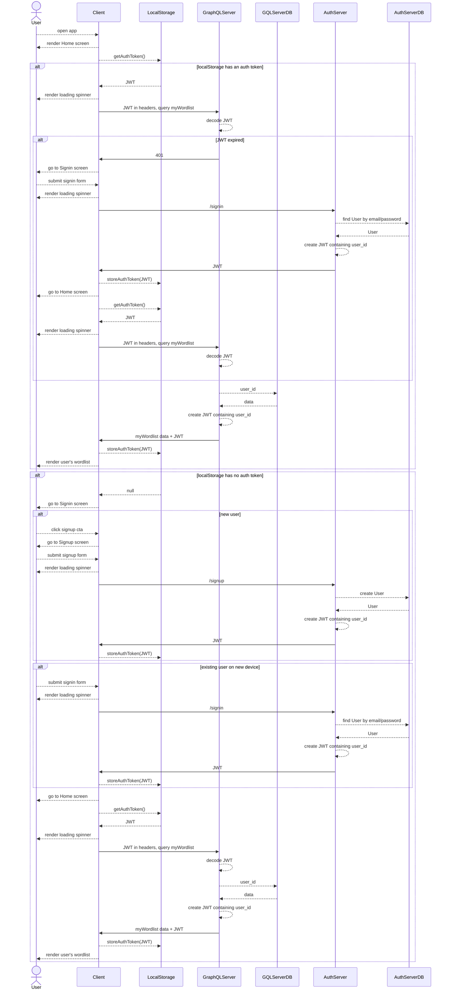

# MyWordlist

## Sequence diagram
### Key
* `Client`: The MyWordlist mobile app or other frontend client
* `GraphQLServer`: https://github.com/Yorkshireman/my_wordlist_graphql
* `GQLServerDB`: `my_wordlist_graphql`'s provisioned postgres database
* `AuthServer`: https://github.com/Yorkshireman/authentication-server
* `AuthServerDB`: `authentication-server`'s provisioned postgres database

